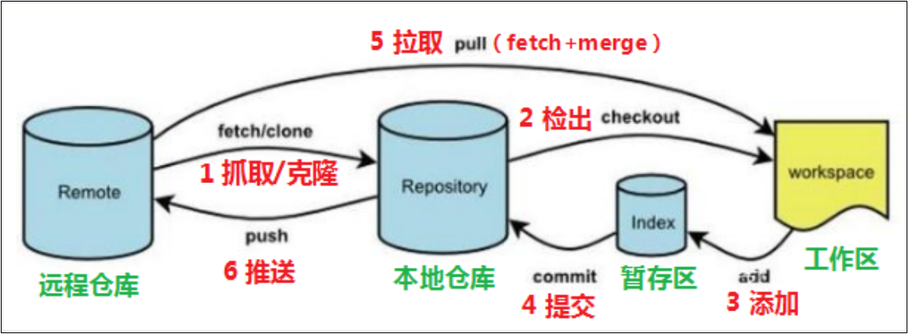

# 重要指令

- 工作流程图上的7个指令
  - clone
  - fetch
  - pull
  - checkout
  - add
  - commit
  - push

- 2个常用指令
  - log
  - merge

## 常用指令速查

### 基本操作类

- 初始化仓库
  - git init
- 工作区 -> 暂存区（添加到暂存区）
  - git add <文件名>
  - git add .
- 暂存区 -> 仓库

  - git commit -m ‘注释’
- 查看状态

  - git status
- 查看提交记录（查看日志）

  - git log	
  - git-log（这个命令很重要！！！）
- 版本回退（理解即可）

  - git reset --hard  <commitID>

### 分支切换类

- 查看分支

  - git branch

- 创建并切换分支（分支原来不存在）
  - git branch -b <分支名>

- 分支合并（首先切换到目标分支上）
  - git merge <分支名>

- 切换到某个分支
  - git checkout <分支名>

### 远程操作

- Github、Gitee（码云）、GitLab
- clone远程仓库到本地
  - git clone <远程仓库地址> [可选命名本地文件夹]
- 拉取远端仓库的修改并合并到master
  - git pull
- 推送本地修改带远端分支
  - git push
  - --set-upstream表示和远端分支绑定关联关系，只有第一次推送时才需要此参数
